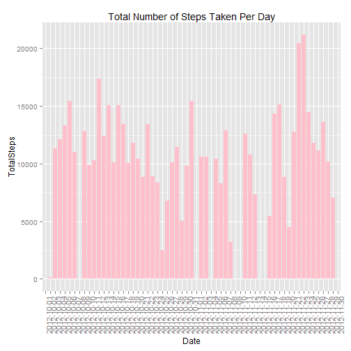
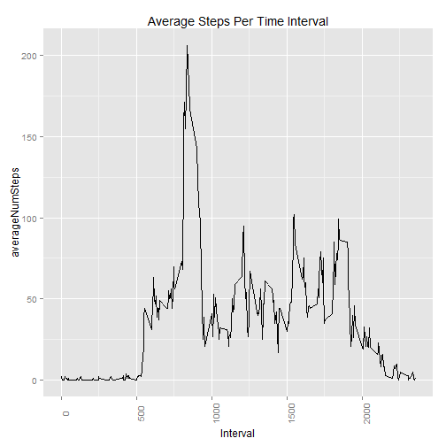
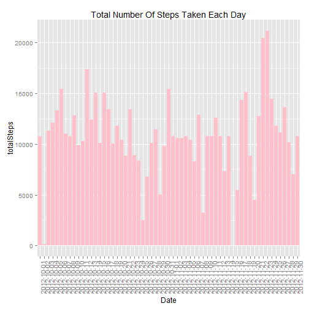
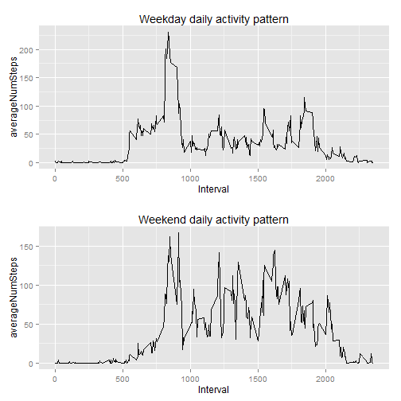

##Loading and preprocessing the data

```r
#install.packages("ggplot2")
#install.packages("grid")
#install.packages("gridExtra")
library(grid)
library(gridExtra)
library(ggplot2)
library(knitr)
input <- read.csv("activity.csv")
#suppress scientific notation
options(scipen=999)
```
##What is the total number of steps taken per day?

```r
#compute total steps each day, ignoring missing values
summarydata <- aggregate(input$steps, by = list(input$date), FUN = sum, na.rm=TRUE)
names(summarydata) <- c("Date", "TotalSteps")
ggplot(summarydata, aes(x = Date, y = TotalSteps)) +
geom_bar(stat = "identity", fill="pink") +
theme(axis.text.x = element_text(angle =90)) + ggtitle("Total Number of Steps Taken Per Day")
```

 

###Mean number of steps taken per day

```r
meanTotalSteps <- round(mean(summarydata$TotalSteps))
```
The mean number of steps taken per day is 9354.

###Median number of steps taken per day

```r
medianTotalSteps <- round(median(summarydata$TotalSteps))
```
The median number of steps taken per day is 10395.

##What is the average daily activity pattern?

```r
summarydata2 <- aggregate(input$steps, by = list(input$interval), FUN = mean, na.rm=TRUE)
names(summarydata2) <- c("Interval", "averageNumSteps")
summarydata2$averageNumSteps <- round(summarydata2$averageNumSteps)
```

Bar plot of average steps per time interval

```r
ggplot(summarydata2, aes(x = Interval, y = averageNumSteps)) +
  geom_line(stat = "identity") +
  theme(axis.text.x = element_text(angle =90)) + ggtitle("Average Steps Per Time Interval")
```

 

###5-minute interval containing  the maximum number of steps

```r
intervalWithMaxSteps <- summarydata2$Interval[which.max(summarydata2$averageNumSteps)]
```
The 5-minute interval containing  the maximum number of steps is 835

##Imputing missing values

###Total number of rows with NAs

```r
rowsWithNA <- nrow(input[is.na(input$steps),])
```
The total number of rows with NAs is 2304

###Strategy for filling in all of the missing values in the dataset

```r
#function to fill missing values in data set D1 using mean values for each interval from D2
fillDataSet <- function(D1, D2)
{
  for (i in 1:length(D1$steps))
    if (is.na(D1$steps[i]))
      D1$steps[i] <- D2$averageNumSteps[which(D2$Interval == D1$interval[i])]
  return (D1)
}
```

###Histogram of the total number of steps taken each day  

```r
#compute total steps taken each day using the filled data set
inputFilled <- fillDataSet(input,summarydata2)
summarydataFilled <- aggregate(inputFilled$steps, by = list(inputFilled$date), FUN = sum)
names(summarydataFilled) <- c("Date", "totalSteps")

#draw the bar plot

ggplot(summarydataFilled, aes(x = Date, y = totalSteps)) +
  geom_bar(stat = "identity", fill="pink") +
  theme(axis.text.x = element_text(angle =90)) + ggtitle("Total Number Of Steps Taken Each Day")
```

 

###Mean number of steps taken per day

```r
meanTotalStepsFilled <- round(mean(summarydataFilled$totalSteps))
```
The mean number of steps taken per day is 10766

###Median number of steps taken per day

```r
medianTotalStepsFilled <- round(median(summarydataFilled$totalSteps))
```
The median number of steps taken per day is 10762

###Impact of imputing missing data on the estimates of the total daily number of steps
The mean number of steps has increased from 9354 to 10766. 
The median number of steps has increased from 10395 to 10762.

##Differences in activity patterns between weekdays and weekends

New factor variable in the dataset with two levels - "weekday" and "weekend" 

```r
inputFilled$dayofweek <- weekdays(as.Date(inputFilled$date))
inputFilled$weekdayORweekend <- ifelse((inputFilled$dayofweek %in% c("Saturday","Sunday")),"weekend","weekday")
```


###average daily activity pattern on weekday

```r
inputFilledweekday <- inputFilled[(inputFilled$weekdayORweekend == "weekday"),]
summarydataweekday <- aggregate(inputFilledweekday$steps, by = list(inputFilledweekday$interval), FUN = mean)
names(summarydataweekday) <- c("Interval", "averageNumSteps")
summarydataweekday$averageNumSteps <- round(summarydataweekday$averageNumSteps)
```

###average daily activity pattern on weekend

```r
inputFilledweekend <- inputFilled[(inputFilled$weekdayORweekend == "weekend"),]
summarydataweekend <- aggregate(inputFilledweekend$steps, by = list(inputFilledweekend$interval), FUN = mean)
names(summarydataweekend) <- c("Interval", "averageNumSteps")
summarydataweekend$averageNumSteps <- round(summarydataweekend$averageNumSteps)
```

###Time series panel plot averaged across all weekday days or weekend days

```r
plot1 <- ggplot(summarydataweekday, aes(x = Interval, y = averageNumSteps)) +
  geom_line(stat = "identity", position="identity") + ggtitle("Weekday daily activity pattern")
plot2 <- ggplot(summarydataweekend, aes(x = Interval, y = averageNumSteps)) +
  geom_line(stat = "identity", position="identity") + ggtitle("Weekend daily activity pattern")
grid.arrange(plot1, plot2, nrow=2)
```

 

As the two plots show, there are differences between weekday and weekend activity pattern. Specifically, the weekday pattern peaks around time interval 850 and then has another (smaller) peak around time interval 1900.This points to a sedentary life style during the day (presumably desk work).

The weekend pattern peaks for the first time aound the same 850 time interval but then exhibits several other peaks throughout the day with a final peak around time interval 2000. This points to a more active life style during the day. 
